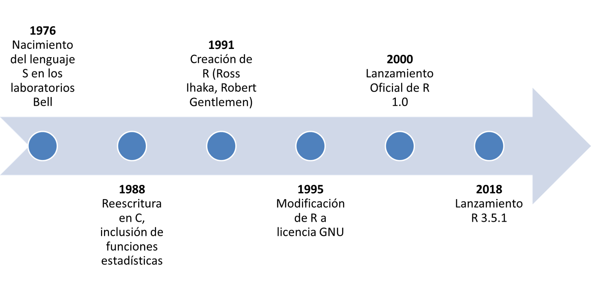
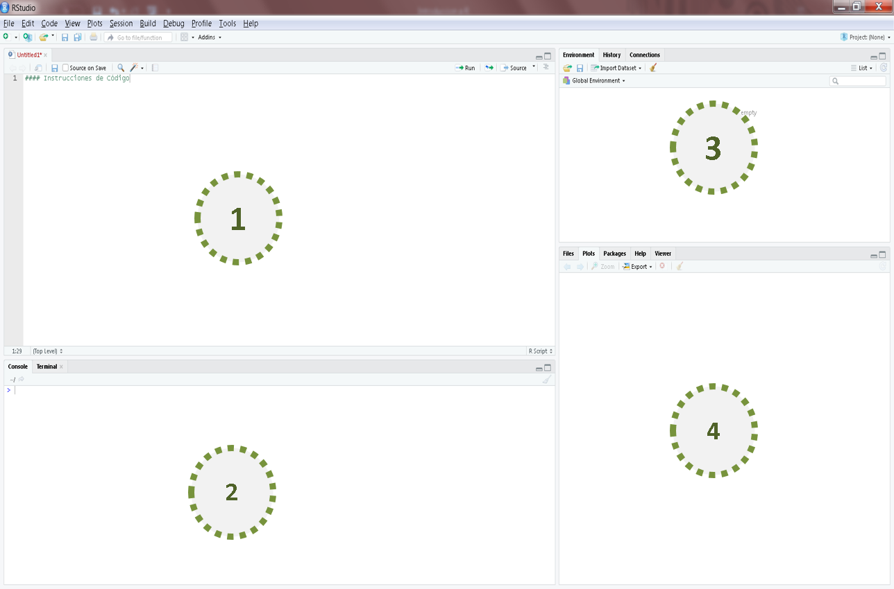

## Introducción

```{r, out.width = "1000px", echo=FALSE, fig.align='center'}

```

## Instalación

El software puede ser descargado de [aqui](https://cran.r-project.org/bin/windows/base/R-3.5.1-win.exe).

Una vez se cuenta con el software se procede a descarad un IDE (Integrated Development Environment) [R Studio](https://www.rstudio.com/products/rstudio/download/#download).

Este último permite escribir y ejecutar código, a la vez que cuenta con interfaces que facilitan ciertos procesos

## Interfaz

```{r, out.width = "800px", echo=FALSE, fig.align='center'}

```

## Opciones de Usuario

```{r, out.width = "500px", echo=FALSE, fig.align='center'}

```

## Paquetes

Los paquetes _"base"_ son cargados por defecto al momento de iniciar una sesión

Hay 29 paquetes suministrados con R (llamados paquetes "estándares" y "recomendados".

Muchos (muchos) más están disponibles para ser instalados a través de [CRAN](http://CRAN.R-project.org) 

## CRAN

The Comprehensive R Archive Network (CRAN) es el repositorio de los paquetes aprobados por R

Existen otros repositorios de los cuales se pueden instalar paquetes:

- Bioconductor.
- Github. 
- Etc.

```{r, echo=FALSE, fig.align='center', out.width = "380px"}

```

## Instalación de Paquetes

Según el Repositorio del que se desea instalar la instrucción cambia e incluso puede depender de otros paquetes.
 
Adicionalmente R-Studio ofrece la interfaz de instalación de paquetes

Todo paquete debe ser cargado al ambiente de trabajo. Cada vez que se abre una sesión es necesario cargar los paquetes


## Ayudas

* Supongamos que queramos conocer sobre la función ```mean``` de R ```?mean``` o ```help(mean)``` abren la pagina de ayuda sobre la función.

* ```??mean``` realiza una búsqueda por palabras clave en el help.

* Hay muchas comunidades de discusión y foros sobre los problemas típicos que los usuarios encuentran usando R Por ejemplo: 

  + [StackOverflow](http://stackoverflow.com/)
  + [R Dir](https://r-dir.com/community/forums.html)
  + En general, muchas preguntas que se puedan tener ya tienen respuesta en Internet.
  

## Ambiente de Trabajo

El directorio de trabajo es por defecto el folder "Home"

La carpeta *"Home"* es modificable desde las opciones de usuario.

Es posible cambiar el directorio de trabajo en cada sesión.

La creación de un proyecto permite asignar directorios de trabajo de una manera integrada

Una vez se establezca el directorio de trabajo, es posible navegar por los archivos desde R-Studio 


## Paquetes Recomendados:

* dplyr : Manipulación de Dataframes
* tidyr : Data Wrangling.
* Rcmdr : Interfaz gráfica para ciertas tareas de R
* data.table: Manipulación de Dataframes
* ggplot2 : Gráficos estilizados
* forecast: Pronósticos de datos temporales
* agricolae: Paquete especializado en diseños de experimentos
* shiny : Creación de Dashboards
* Un largo etc.
